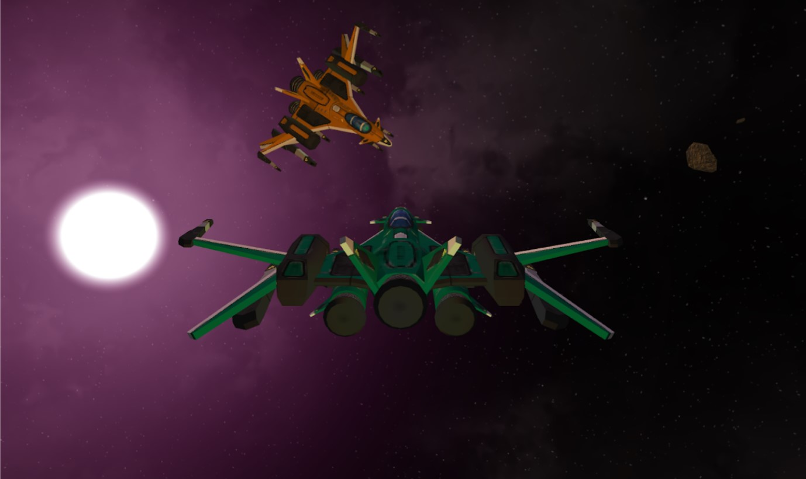

# Space Fighters

## Overview

A WebGL-3D Space Dogfight Simulator. Rendered using TWGL with data storage and scene graph using THREEJs. Used Webpack and Nodejs to handle libraries and package management.

## Project Usage

### How To Run

1. Requires npm (version 8.1.1 used in project) and node.js (version 17.0.1 used in project).
2. Run the npm install (i) to get the packages required to run the server:
**npm i**
3. Start the application from command line in the directory folder:
**npm start**
4. Access the application at **localhost:8080**

### How To Play

1. Open two windows at localhost:8080 (a single window cannot play multiplayer and  a window in the background will not send messages to socket.io). We will refer to the different windows as different “players”.

2. Customize the ships as you desire, using the arrow buttons on screen to alternate the colors.

3. When ready, create a room with one “player” by using the **Create Room** button. A **Room Id** will appear on screen to connect to the room. Use the other player, typing in the **Room Id** into the empty text field next to the **Join Room** button. Afterwards, press the **Join Room** button and you will connect to the match.

4. Once both “players” are in the room, the game will begin. Both players will begin at a distance, facing each other.

5. The ship uses plane-like controls:
  - Pitch: **W/S (Down/Up)**
  - Roll: **A/D (Left/Right)**
  - Strafe: **Q/E (Left/Right)**
  - Thrust: **SPACE/C (Increase/Decrease)**
  - Fire: **F (Fire Missile)**

6. The ship will collide with asteroids nearby and with the other ship, upon collision with an asteroid, the “player” will lose. Upon collision with the other ship, both “players” will lose.

7. To attack each other, “players” can fire **Homing Missiles** towards each other using the F key.

8. Upon the missile hitting the enemy ship, the “player” will win and the enemy will lose.

## Specifications / Features

### Menu Screen

The game will first start with a main menu, where the player can customize their ship's color, and either create a room or join a room; Creating a room will create a room code that other players can use to join. Once both players are in the same room, the main part of the game begins. The Menu Screen consists of HTML UI Elements and WebGL rotating ship, point light and ambient lighting, and a pedestal underneath the ship.

### Game

The lighting system allows for four lights to be rendered in a scene, and allows for ambient light, point lights, and directional lights. Their intensities and colors can also be adjusted. For point lights, there is light attenuation, which allows for light to realistically drop off at a distance. These lights help give a more space-like feel to the game.

The camera is a child of the spaceship, so it will follow the spaceship's orientation around even while it is moving and rotating.

During the game, players will be able to fly around in their ships, and shoot at each other with missiles. Collision is done using sphere colliders, and are calculated for ship to ship collision and ship to asteroid collision and ship to missile collision. Since asteroids don't move, there is no need to calculate asteroid to asteroid collision.

Players can also shoot missiles at each other, which will follow the opponent by rotating towards them over time.

When a player collides with anything (another player, an asteroid, or a missile) they die and lose; at this point, if the other player is alive, they win. Both players are then taken to a game over screen saying whether they won or lost. They both can then go back to the main menu and play again.

## Credits

### Kyle Cochran (Ch1pless)

- Built THREEJs to TWGL compatibility. 

- Developed a TWGL Renderer that uses THREEJs Scene Graph to move through the scene and apply matrix transforms and uniforms while rendering.

- Developed Match Making functionality and interface and Multiplayer functionality.

- Implemented Modified Phong Lighting in the rendering system and created the SkyBox renderer.

- Developed an Initial Player Controller and Application Manager.

- Managed Backend and Package Management.

- Worked on player control and overall movement.

- Worked on developing and designing the physics collision system for the game.

- Worked on implementing the weapons system.

- Worked on the UI.

### Jay Doshi (CodeJ-dev)

- Found player and missile object files and also found player textures. 

- Rendered the Missile on firing. 

- Worked on having the missile being able to rotate in the direction of the player while it is firing. 

- Worked on player control and having the missile fire when clicking keyboard input. 

- Assisted in implementation of lighting in the rendering system